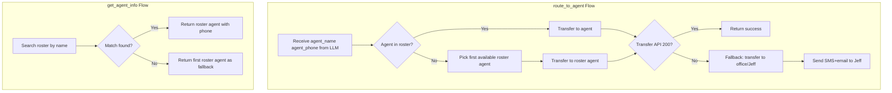

# Roster-Based Call Transfer Integration Plan

## Summary

Replace BoldTrail as the agent source with `data/agent_roster.json`. Add validation so only roster-matched agents are used; fallback to a roster agent if the requested agent does not match; fallback to Jeff (via existing Vapi tool) if transfer still fails; and send SMS+email to Jeff when no one picks.

---

## Architecture Overview

---

## 1. Create Roster Service

**New file:** [src/utils/roster.py](src/utils/roster.py)

- Load and cache `data/agent_roster.json` (agents + staff; exclude trusted_partner_title_staff for transfers unless client wants them)
- Expose: `load_roster()`, `find_agent_by_name(name)`, `find_agent_by_phone(phone)`, `is_agent_in_roster(name, phone)`, `get_any_agent()`, `get_roster_phone_for_name(name)`
- Normalize phone for comparison: strip non-digits, compare last 10 digits
- Name matching: case-insensitive, support partial matches (e.g. "Sally" matches "Sally Love")
- Configurable roster path via settings (default: `data/agent_roster.json`)

---

## 2. Refactor get_agent_info

**File:** [src/functions/get_agent_info.py](src/functions/get_agent_info.py)

- Remove BoldTrail usage for agent lookup
- Use roster service:
  - If `agent_name` provided: `find_agent_by_name(agent_name)`; if no match, `get_any_agent()` as fallback
  - If no params: return first N agents (e.g. 5) or main office contact
- Response format: each agent must have `phone` (from `cell_phone`) for `route_to_agent`
- Map roster schema to existing response shape, e.g. `{"name": "X", "phone": "352-...", "firstName": "X", "lastName": ""}` for compatibility
- Include `data.roster_matched: true/false` so caller knows if it was an exact match or fallback

---

## 3. Refactor route_to_agent

**File:** [src/functions/route_to_agent.py](src/functions/route_to_agent.py)

### 3.1 Roster validation (before transfer)

1. After extracting `agent_name`, `agent_phone` from tool arguments:
2. Call `is_agent_in_roster(agent_name, agent_phone)`:
  - If **not in roster**: replace with `get_any_agent()` (first agent from roster with valid cell_phone)
  - Log: "Agent X not in roster; using fallback agent Y"
3. If roster has no agents with valid phone: use main office from roster or settings (Jeff/office)

### 3.2 Remove BoldTrail agent verification

- Remove `agent_data = await crm_client.get_agent(agent_id)` and related BoldTrail logic
- Keep Transfer Gate (lead_id, caller_name, caller_phone)
- Keep phone formatting to E.164
- Keep TEST_MODE override

### 3.3 Fallback chain on transfer failure

Current behavior: on exception, try office line. Update to:

1. If transfer POST fails (non-200 or exception): call `send_failed_transfer_notification` (already sends SMS+email to Jeff/office)
2. Try fallback transfer to Jeff/office (OFFICE_NOTIFICATION_PHONE or JEFF_NOTIFICATION_PHONE)
3. If fallback also fails: still send notification; return error message telling caller an agent will call back

### 3.4 Jeff notification for "no one picks"

- `route_to_agent` returns 200 when Vapi accepts the transfer; it does not know if the agent answered
- "No one picks" is signaled later via Vapi webhooks (e.g. end-of-call-report, status-update)
- Add handling in [src/webhooks/vapi_webhooks.py](src/webhooks/vapi_webhooks.py):
  - In `handle_end_of_call`: inspect `endReason` or similar for transfer-related outcomes (e.g. "transfer-failed", "no-answer")
  - When detected: call a shared `send_no_answer_notification_to_jeff(caller_name, caller_phone, attempted_agent)` that sends SMS and email to Jeff
- Vapi webhook payload structure for transfer outcomes may need verification; document assumptions and add logging

---

## 4. Enrich check_property Listing Agent with Roster

**File:** [src/functions/check_property.py](src/functions/check_property.py)

- Listing agent comes from XML/CRM (`agentName`, `agentPhone`)
- Before returning `listing_agent` / `transfer_phone`, validate against roster:
  - If `agentName` matches roster: use roster `cell_phone` (authoritative)
  - If no match or missing phone: use `get_roster_phone_for_name(agentName)` or `get_any_agent()` as fallback
- Ensures `route_to_agent` always receives a roster-validated phone

---

## 5. Settings and Configuration

**File:** [src/config/settings.py](src/config/settings.py)

- Add: `AGENT_ROSTER_PATH: str = "data/agent_roster.json"` (optional, with default)
- Add: `JEFF_NOTIFICATION_EMAIL: str = ""` (optional; if empty, use `OFFICE_NOTIFICATION_EMAIL` for Jeff emails)
- Ensure `send_failed_transfer_notification` and the new no-answer notification use:
  - SMS: `JEFF_NOTIFICATION_PHONE` or `OFFICE_NOTIFICATION_PHONE`
  - Email: `JEFF_NOTIFICATION_EMAIL` or `OFFICE_NOTIFICATION_EMAIL`

---

## 6. Update send_failed_transfer_notification

**File:** [src/functions/route_to_agent.py](src/functions/route_to_agent.py)

- Ensure it sends both SMS and email to Jeff when a transfer fails
- Uses `JEFF_NOTIFICATION_PHONE` / `OFFICE_NOTIFICATION_PHONE` for SMS and `OFFICE_NOTIFICATION_EMAIL` (or `JEFF_NOTIFICATION_EMAIL`) for email
- Add `send_no_answer_to_jeff` helper (or extend this) for the "no one picks" case, called from the Vapi webhook handler

---

## 7. Vapi Webhook: No-Answer Handling

**File:** [src/webhooks/vapi_webhooks.py](src/webhooks/vapi_webhooks.py)

- In `handle_end_of_call` (and possibly `handle_status_update`): detect when a transfer was attempted but the call ended without connection
- Trigger: `send_no_answer_notification_to_jeff(...)` with caller info and attempted agent
- Challenge: Vapi payload for "transfer no answer" must be inspected; implement detection logic based on actual webhook schema (e.g. `endReason`, `status`, or custom fields)
- If schema is unclear: add logging of full payload and implement a best-effort heuristic; document for future refinement

---

## 8. Knowledge Base and Prompts

**Files:** [docs/vapi/VAPI_KNOWLEDGE_BASE.txt](docs/vapi/VAPI_KNOWLEDGE_BASE.txt), [docs/vapi/VAPI_SYSTEM_PROMPT_2.md](docs/vapi/VAPI_SYSTEM_PROMPT_2.md)

- State that agent data comes from the roster (`get_agent_info`, `check_property` listing agent)
- Document fallback order: requested agent (if in roster) -> roster agent -> Jeff (separate Vapi tool)
- If transfer cannot be completed: use Jeff transfer tool; confirm caller details and use Next Steps phrase
- Remove or update references to BoldTrail for agent lookup

---

## 9. Context and Documentation

**File:** [.cursor/context.json](.cursor/context.json)

- Record that `agent_roster.json` is the agent source for transfers
- Update `get_agent_info` and `route_to_agent` descriptions
- Document fallback chain and Jeff notification behavior

---

## 10. Tests

- Unit tests for roster service: `find_agent_by_name`, `is_agent_in_roster`, `get_any_agent`, phone normalization
- Update `test_call_transfer.py` to mock roster instead of BoldTrail
- Test `get_agent_info` returns roster data with `phone` field
- Test `route_to_agent` validation: unknown agent replaced with roster fallback
- Optional: integration test for no-answer webhook if payload format is known

---

## Implementation Order

1. Create roster service ([src/utils/roster.py](src/utils/roster.py))
2. Refactor get_agent_info to use roster
3. Refactor route_to_agent: roster validation, remove BoldTrail, keep fallbacks
4. Enrich check_property with roster validation
5. Add settings (AGENT_ROSTER_PATH, JEFF_NOTIFICATION_EMAIL)
6. Implement no-answer detection in Vapi webhook and send notification to Jeff
7. Update KB, system prompt, context.json
8. Add/update tests

---

## Open Questions / Clarifications

1. **Trusted Partner Title staff:** Should TPT staff (e.g. Chesney McGee-Johnson, Kim Cosgrove) be transfer targets, or only `agents` and `staff`?
2. **Jeff transfer tool:** Confirmed as a separate Vapi tool; no backend changes needed. The AI uses it when roster transfers fail. Correct?
3. **Vapi "no answer" event:** Exact webhook event/fields for "transfer attempted, no one answered" need to be confirmed from Vapi docs or logs. Plan assumes we can detect this in `end-of-call-report` or `status-update`.

